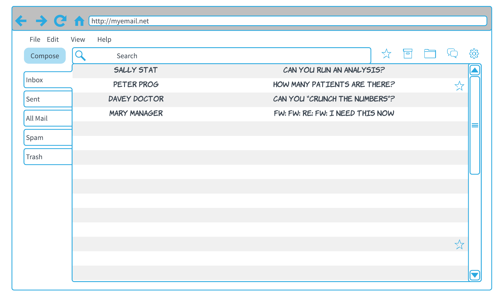
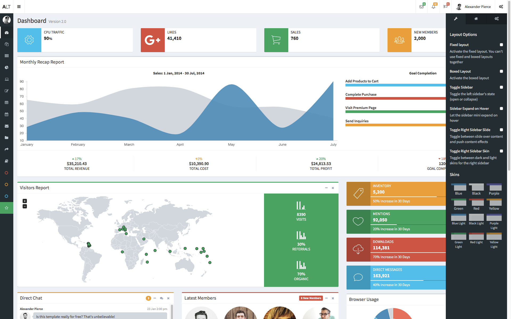
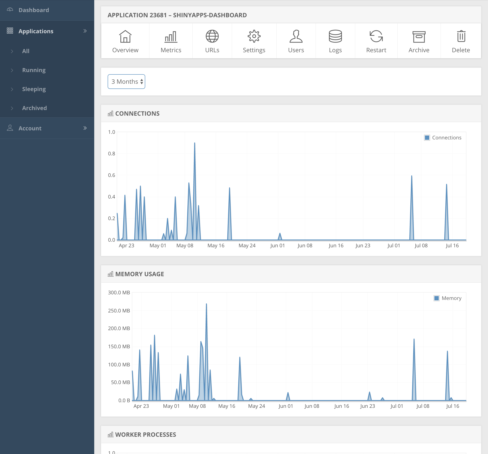
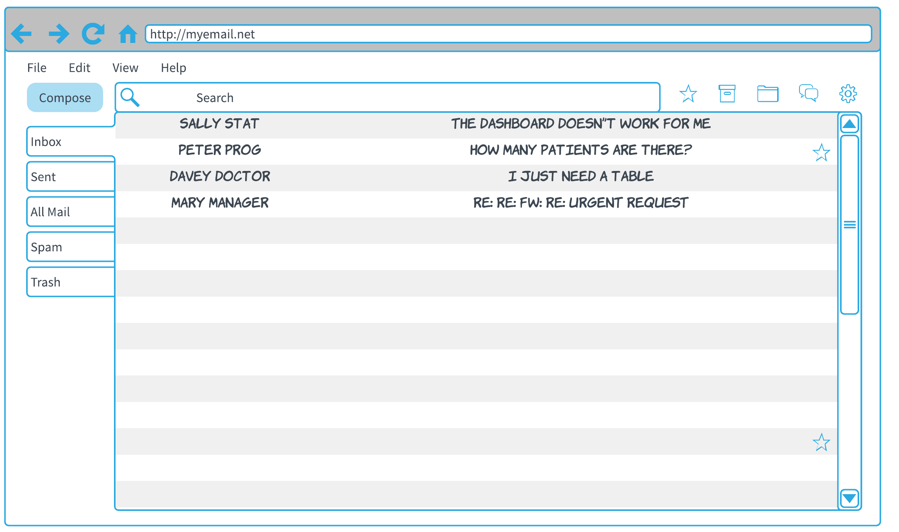
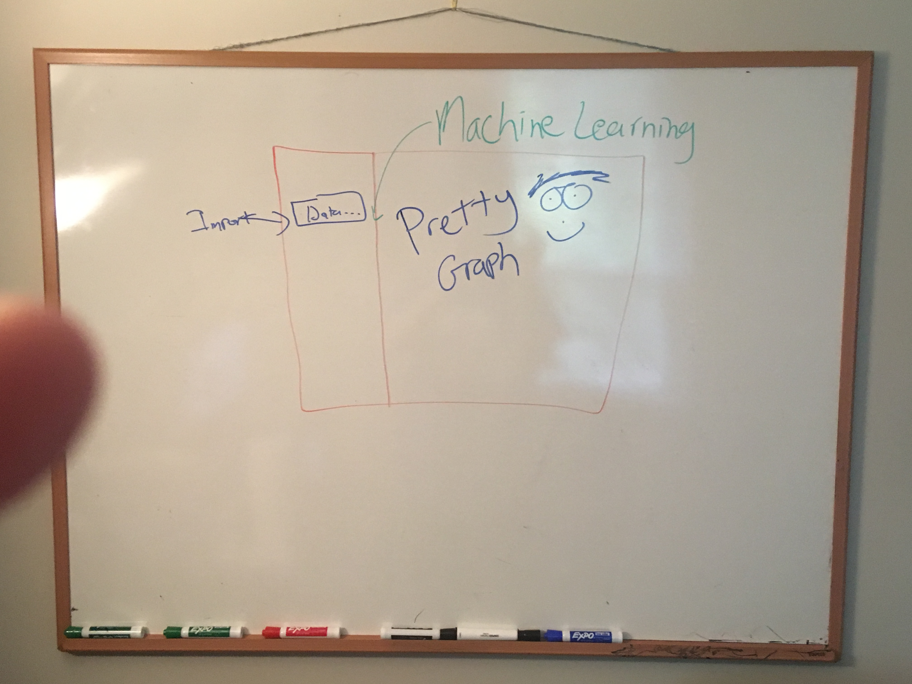
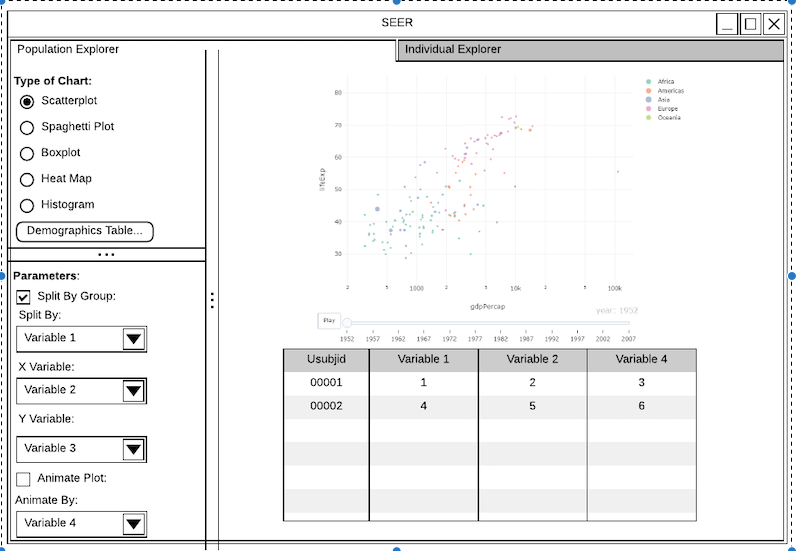
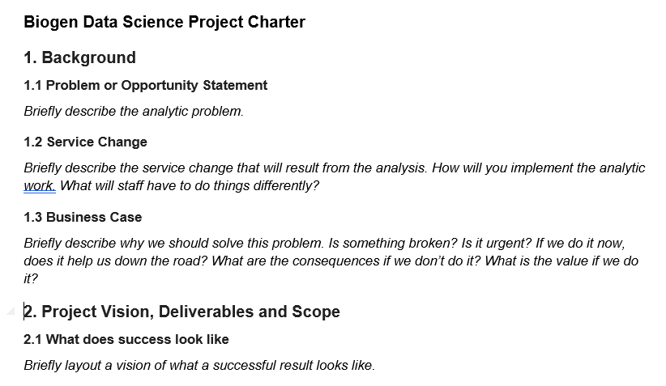
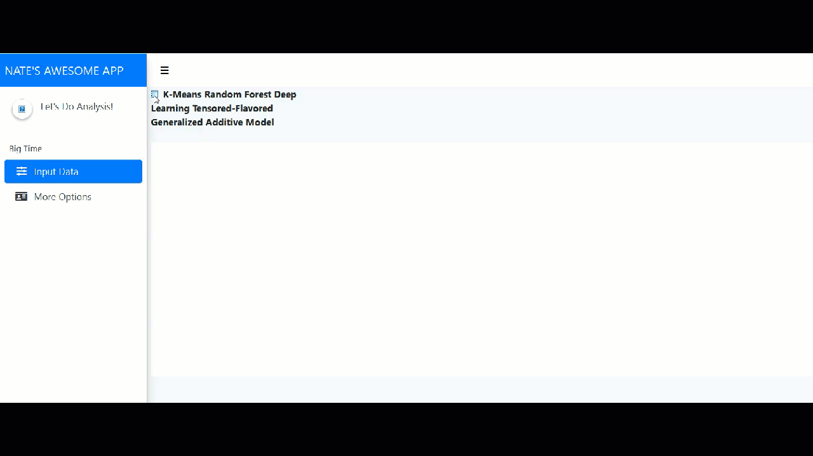
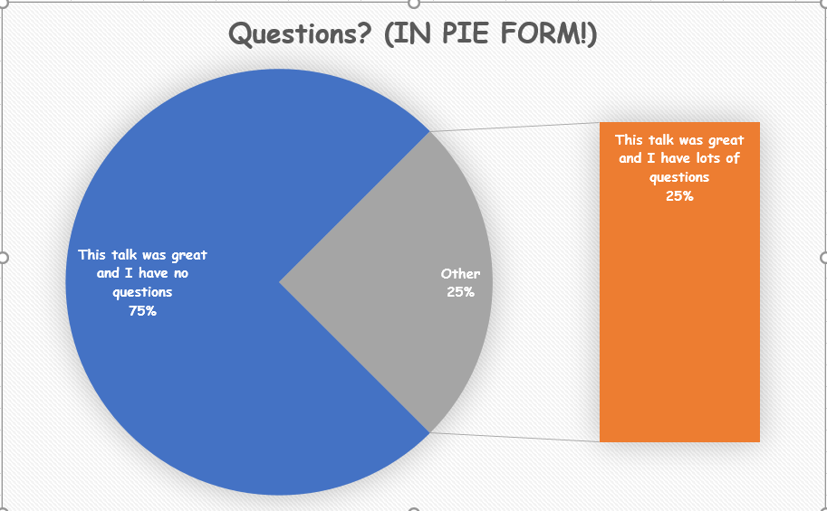

```{r setup, include=FALSE}
options(htmltools.dir.version = FALSE)
```

```{r xaringan-themer, include=FALSE}
library(xaringanthemer)
solarized_dark(
  code_font_family = "Fira Code",
  code_font_url    = "https://cdn.rawgit.com/tonsky/FiraCode/1.204/distr/fira_code.css"
)
```

#My background
## How to make it in management
---
class: animated, lightSpeedIn
#My background
## ~~How to make it in management~~
##<span style="color:yellow">The joys of mid-tier individual contributor-ing</span>
---
# My life in 2017

---
# Let's build A Shiny! (Note: Not the actual one)

---
#Did you know you can measure connections?

---
#How many times was it accessed?
--
background-image: url(https://vignette.wikia.nocookie.net/muppet/images/0/0d/4172c.jpg/revision/latest?cb=20090207020135)
---
background-image: url(https://media.giphy.com/media/a79Jr229u3bzO/giphy.gif)
background-position: 50% 80%
#MRW When The Shiny App You Spent Two Months Writing Has A Grand Total Of 6 Connections And It's Time to Write Your Yearly Self-Evaluation
---
# My life in ~~2017~~ **2018**

---
##Where Did I Go Wrong?
- I believed my <span style="color:yellow">~~idiot~~</span> users

--
- Specifically I failed to do the following:
--

1. Collect distinct and measureable requirements
2. Work with the team
3. Give it in stages so they can give feedback
---
# Step 1: What They Say != The Problem
- What is the problem that you are trying to solve?

---
# Let's Take Some Bad Objectives and Make Them Not Bad
- <span style="color:red">"I want a dashboard to let us explore the data" </span>

--

- "<span style="color:green">Lower the amount of adhoc requests given to the department by 20%" </span>

--

- <span style="color:red">"I want instantaneous access to the data" </span>

--

- "<span style="color:green">Decrease time to a decision point by 2 days" </span>
--

- <span style="color:red">"Carl is going to jump out of a window if he keeps getting requests to modify colors in his ggplots" </span>

--

- "<span style="color:green"> Work done on Project X is increased by 30% due to Carl's availability (due to not jumping out of a window) </span>"
---
# Step 2: Investigate Alternatives
- Why not use?
- Tableau, JMP, Power BI, Spotfire, A Well Trained Dog
- Your dashboard will never be as good as these.
--

- **Except JMP. It will be probably be better than JMP**
---

# Step 3: Whiteboard the UI!
- Have **them** draw the UI on a whiteboard


---

#Step 4: Wireframe the Whiteboard
- Lots of free options out there.


---
#Step 5: Write out a Charter:

---
#Step 6: Program the app?
- I like to program the entire UI (no server) and let them play with it before I start the real coding.


---
background-image: url(https://media.giphy.com/media/3o84sq21TxDH6PyYms/giphy.gif)
# Warning: Don't let them add anything
- Once they get a taste of an additional feature, they will **never stop**.
---
background-image: url(https://media.giphy.com/media/a79Jr229u3bzO/giphy.gif)
#Turn this
---
background-image: url(https://media.giphy.com/media/msKNSs8rmJ5m/giphy.gif)
# Into this!
---
#Questions/Comments?



